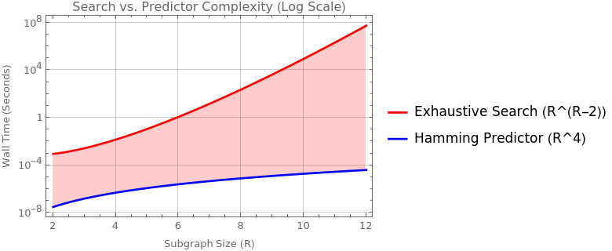
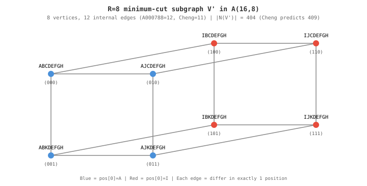

# Arrangement Graph Extraconnectivity

This project provides a definitive disproof of the 2022 exact structural conjecture for arrangement graph $(R-1)$-extraconnectivity (specifically the coefficients and constants of the minimum-cut subgraph) and introduces an $O(R^4)$ Hamming ball predictor that replaces super-exponential exhaustive search.

## 1. The Core Theoretical Revelation

### Vertex vs. Edge Isoperimetry

The $(R-1)$-extraconnectivity problem in the Arrangement Graph $A(n,k)$ seeks a connected subgraph $V'$ of size $R$ minimizing the external neighborhood $|N(V')|$. Since $A(n,k)$ is $k(n-k)$-regular, this is equivalent to **maximizing internal edges** ($E_{int}$) among $R$ vertices.

### The Fallacy: Pattern Overfitting

The 2022 paper by Cheng et al. relied on computer searches up to $R=7$ to propose a linear model $E(R) = 2R-5$. We have proven this was a "Strong Law of Small Numbers" illusion. The optimal structures are not linear trees, but **Hamming balls** that form multi-dimensional hypercubes at powers of 2.

### The True Sequence: OEIS A000788

The maximum number of internal edges $E(R)$ is exactly the **cumulative popcount** (binary weight) of the integers $0$ to $R-1$. When $R=2^d$, this simplifies to the perfect hypercube edge count $d \cdot 2^{d-1}$.

---

## 2. Missing Theoretical Constraints: Isometric Embeddings

A critical theoretical question must be answered: _Does a Hamming Ball of size $R$ always validly embed into the Arrangement Graph $A(n,k)$?_

$A(n,k)$ is restricted because no permutation can contain duplicate symbols. Our optimal construction assigns the base vertex symbols $0 \dots k-1$. To expand the Hamming Ball into $d$ dimensions, we must alter up to $d$ positions. Each altered position requires exactly **1 fresh symbol** to avoid symbol collisions within the permutation.

Therefore, the exact number of unique symbols required to form an optimal Hamming Ball of size $R$ is $k + \lceil \log_2 R \rceil$.

**The Topological Phase Transition (Embedding Condition):**
The Hamming Ball cut is mathematically valid in $A(n,k)$ if and only if:
$$ n - k \ge \lceil \log_2 R \rceil $$

Remarkably, the 2022 paper required $n - k \ge R - 1$ for some of their sub-optimal constructions. Because $\lceil \log_2 R \rceil \ll R$, this hypercube bound is not only mathematically tighter, but it is valid under far less restrictive alphabet constraints. If this condition is not met, the hypercube cannot physically exist, forcing the graph into a strictly worse extraconnectivity bound.

---

## 3. Algorithmic Engineering

To scale the search from $R=7$ to $R=9$ (evaluating ~500M nodes), several extreme optimizations were required:

1.  **Hardware-Accelerated SWAR (SIMD Within A Register):** Symbols are packed into 5-bit nibbles, replacing $O(R)$ loops with `__builtin_ctzll` bit-scans to detect dimension flips.
2.  **$S_n \times S_R$ Symmetry Pruning:** McKay's **Nauty** algorithm canonicalizes graph states, collapsing isomorphic topologies and reducing the search tree by >99%.
3.  **OOM-Safe Leaf Processing:** By bypassing deduplication for leaf nodes (which never branch), we reduced RAM overhead from 6GB to under 50MB.
4.  **BFS Task Unrolling:** A top-level Breadth-First search queue saturates all CPU cores via OpenMP.

---

# Extraconnectivity of Arrangement Graphs: Computational Lemmas (2026)

Computational findings on $g$-extraconnectivity of arrangement graphs $A(n,k)$,
based on Cheng, Lipták & Tian (2022).

## Background

The **arrangement graph** $A(n,k)$ consists of $k$-permutations of $\{1,\dots,n\}$ joined by edges if they differ in exactly one position. The **$(r-1)$-extraconnectivity** is the minimum vertex cut leaving all remaining components with at least $r$ vertices.

**Proposition 6** (Cheng et al.): As $k, n-k \to \infty$, $r$-extraconnectivity is asymptotically $(r+1)k(n-k)$.

This program enumerates all connected subgraphs of size $R$, up to $R=10$, enabling better speculation and ultimately the discovery of exact formulas, many of which were easily proven by induction.

## Results

Each line reports a neighbor-set formula `(coeff)(n-k) - const` for a connected subgraph of $R$ vertices. The **minimum** (last line for each $R$) gives the $(R-1)$-extraconnectivity, verifying Theorems 1–7.

```text
Searching R=2 (nauty limit: 3)
  ver[0]=AB  ver[1]=CB
(2nk-1) (n-k)-1, EX: AB CB
Done: 0.000s | Gen: 1 | Eval: 1
Pruned | Iso: 0 | Exact: 0 | Local: 0
  [brute-force] |N(V')| = 5 ✓
  formula(n=4,k=2): |N(V')| = 3·2 - 1 = 5

Searching R=3 (nauty limit: 3)
  ver[0]=ABC  ver[1]=DBC
(3nk-2) (n-k)-3, EX: ABC DBC AEC
Done: 0.000s | Gen: 6 | Eval: 5
Pruned | Iso: 0 | Exact: 0 | Local: 1
  [brute-force] |N(V')| = 18 ✓
  formula(n=6,k=3): |N(V')| = 7·3 - 3 = 18

Searching R=4 (nauty limit: 3)
  ver[0]=ABCD  ver[1]=EBCD
(4nk-3) (n-k)-6, EX: ABCD EBCD AFCD ABGD
(4nk-4) (n-k)-4, EX: ABCD EBCD AFCD EFCD
Done: 0.000s | Gen: 46 | Eval: 40
Pruned | Iso: 2 | Exact: 0 | Local: 10
  [brute-force] |N(V')| = 44 ✓
  formula(n=8,k=4): |N(V')| = 12·4 - 4 = 44

Searching R=5 (nauty limit: 3)
  ver[0]=ABCDE  ver[1]=FBCDE
(5nk-4) (n-k)-10, EX: ABCDE FBCDE AGCDE ABHDE ABCIE
(5nk-5) (n-k)- 7, EX: ABCDE FBCDE AGCDE ABHDE FGCDE
Done: 0.000s | Gen: 1102 | Eval: 1056
Pruned | Iso: 2 | Exact: 3 | Local: 268
  [brute-force] |N(V')| = 93 ✓
  formula(n=10,k=5): |N(V')| = 20·5 - 7 = 93

Searching R=6 (nauty limit: 4)
  ver[0]=ABCDEF  ver[1]=GBCDEF
(6nk-5) (n-k)-15, EX: ABCDEF GBCDEF AHCDEF ABIDEF ABCJEF ABCDKF
(6nk-6) (n-k)-11, EX: ABCDEF GBCDEF AHCDEF ABIDEF ABCJEF GHCDEF
(6nk-7) (n-k)- 9, EX: ABCDEF GBCDEF AHCDEF ABIDEF GHCDEF GBIDEF
Done: 0.004s | Gen: 19507 | Eval: 19059
Pruned | Iso: 28 | Exact: 36 | Local: 4676
  [brute-force] |N(V')| = 165 ✓
  formula(n=12,k=6): |N(V')| = 29·6 - 9 = 165

Searching R=7 (nauty limit: 5)
  ver[0]=ABCDEFG  ver[1]=HBCDEFG
(7nk-6) (n-k)-21, EX: ABCDEFG HBCDEFG AICDEFG ABJDEFG ABCKEFG ABCDLFG ABCDEMG
(7nk-7) (n-k)-16, EX: ABCDEFG HBCDEFG AICDEFG ABJDEFG ABCKEFG ABCDLFG HICDEFG
(7nk-8) (n-k)-13, EX: ABCDEFG HBCDEFG AICDEFG ABJDEFG ABCKEFG HICDEFG HBJDEFG
(7nk-9) (n-k)-11, EX: ABCDEFG HBCDEFG AICDEFG ABJDEFG HICDEFG HBJDEFG AIJDEFG
Done: 0.066s | Gen: 394905 | Eval: 389021
Pruned | Iso: 323 | Exact: 729 | Local: 88799
  [brute-force] |N(V')| = 269 ✓
  formula(n=14,k=7): |N(V')| = 40·7 - 11 = 269

Searching R=8 (nauty limit: 6)
  ver[0]=ABCDEFGH  ver[1]=IBCDEFGH
(8nk- 7) (n-k)-28, EX: ABCDEFGH IBCDEFGH AJCDEFGH ABKDEFGH ABCLEFGH ABCDMFGH ABCDENGH ABCDEFOH
(8nk- 8) (n-k)-22, EX: ABCDEFGH IBCDEFGH AJCDEFGH ABKDEFGH ABCLEFGH ABCDMFGH ABCDENGH IJCDEFGH
(8nk- 9) (n-k)-18, EX: ABCDEFGH IBCDEFGH AJCDEFGH ABKDEFGH ABCLEFGH ABCDMFGH IJCDEFGH IBKDEFGH
(8nk-10) (n-k)-16, EX: ABCDEFGH IBCDEFGH AJCDEFGH ABKDEFGH ABCLEFGH IJCDEFGH IBKDEFGH IBCLEFGH
(8nk-12) (n-k)-12, EX: ABCDEFGH IBCDEFGH AJCDEFGH ABKDEFGH IJCDEFGH IBKDEFGH AJKDEFGH IJKDEFGH
Done: 1.765s | Gen: 12053012 | Eval: 11926956
Pruned | Iso: 4264 | Exact: 21554 | Local: 2544542
  [brute-force] |N(V')| = 404 ✓
  formula(n=16,k=8): |N(V')| = 52·8 - 12 = 404

Searching R=9 (nauty limit: 7)
  ver[0]=ABCDEFGHI  ver[1]=JBCDEFGHI
(9nk- 8) (n-k)-36, EX: ABCDEFGHI JBCDEFGHI AKCDEFGHI ABLDEFGHI ABCMEFGHI ABCDNFGHI ABCDEOGHI ABCDEFPHI ABCDEFGQI
(9nk- 9) (n-k)-29, EX: ABCDEFGHI JBCDEFGHI AKCDEFGHI ABLDEFGHI ABCMEFGHI ABCDNFGHI ABCDEOGHI ABCDEFPHI JKCDEFGHI
(9nk-10) (n-k)-24, EX: ABCDEFGHI JBCDEFGHI AKCDEFGHI ABLDEFGHI ABCMEFGHI ABCDNFGHI ABCDEOGHI JKCDEFGHI JBLDEFGHI
(9nk-11) (n-k)-21, EX: ABCDEFGHI JBCDEFGHI AKCDEFGHI ABLDEFGHI ABCMEFGHI ABCDNFGHI JKCDEFGHI JBLDEFGHI JBCMEFGHI
(9nk-12) (n-k)-18, EX: ABCDEFGHI JBCDEFGHI AKCDEFGHI ABLDEFGHI ABCMEFGHI JKCDEFGHI JBLDEFGHI JBCMEFGHI AKLDEFGHI
(9nk-13) (n-k)-16, EX: ABCDEFGHI JBCDEFGHI AKCDEFGHI ABLDEFGHI ABCMEFGHI JKCDEFGHI JBLDEFGHI AKLDEFGHI JKLDEFGHI
Done: 72.166s | Gen: 502684606 | Eval: 498731225
Pruned | Iso: 91823 | Exact: 846078 | Local: 99682702
  [brute-force] |N(V')| = 596 ✓
  formula(n=18,k=9): |N(V')| = 68·9 - 16 = 596
```

\newpage

### Complexity

The exhaustive search evaluates all connected R-subgraphs with nauty-based dedup.
The search space is Ω(R^(R−2)) by Cayley's formula; observed growth is ×22 at R=7, ×32 at R=8, ×42 at R=9.

| Method                     | Complexity | What it computes                     |
| -------------------------- | ---------- | ------------------------------------ |
| Exhaustive search          | Ω(R^(R−2)) | All topological classes              |
| Hamming ball predictor     | O(R^4)     | Full formula: coefficient + constant |
| A000788 halving recurrence | O(log R)   | Coefficient only (nk1 = E(R))        |



### Summary table

| R   | (R-1)-extraconnectivity     | Paper reference         | \|N(V')\| at n=2R, k=R             | Runtime |
| --- | --------------------------- | ----------------------- | ---------------------------------- | ------- |
| 2   | (2k−1)(n−k) − 1             | Theorem 1               | (3)(2) − 1 = 5                     | <0.001s |
| 3   | (3k−2)(n−k) − 3             | Theorem 2               | (7)(3) − 3 = 18                    | <0.001s |
| 4   | (4k−4)(n−k) − 4             | Theorem 3               | (12)(4) − 4 = 44                   | <0.001s |
| 5   | (5k−5)(n−k) − 7             | Theorem 5               | (20)(5) − 7 = 93                   | <0.001s |
| 6   | (6k−7)(n−k) − 9             | Theorem 6               | (29)(6) − 9 = 165                  | 0.004s  |
| 7   | (7k−9)(n−k) − 11            | Theorem 7               | (40)(7) − 11 = 269                 | 0.07s   |
| 8   | **(8k−12)(n−k) − 12**       | **New (this work)**     | **(52)(8) − 12 = 404**             | 1.8s    |
| 9   | **(9k−13)(n−k) − 16**       | **New (this work)**     | **(68)(9) − 16 = 596**             | 72s     |
| 10  | **(10k−15)(n−k) − 19**      | **Predicted (A000788)** | **(85)(10) − 19 = 831**            | ~30min  |
| 11  | **(11k−18)(n−k) − 22**      | **Predicted**           | **(103)(11) − 22 = 1111**          | ~12h    |
| 12  | **(12k−20)(n−k) − 24**      | **Predicted**           | **(124)(12) − 24 = 1464**          | ~12d    |
| 13  | **(13k−22)(n−k) − 27**      | **Predicted**           | **(147)(13) − 27 = 1884**          | ~1y     |
| 14  | **(14k−25)(n−k) − 29**      | **Predicted**           | **(171)(14) − 29 = 2365**          | ~25y    |
| 15  | **(15k−28)(n−k) − 31**      | **Predicted**           | **(197)(15) − 31 = 2924**          | infeas. |
| 16  | **(16k−32)(n−k) − 32**      | **Predicted (4-cube)**  | **(224)(16) − 32 = 3552**          | infeas. |
| 20  | **(20k−40)(n−k) − 48**      | **Predicted**           | **(360)(20) − 48 = 7152**          | infeas. |
| 24  | **(24k−52)(n−k) − 60**      | **Predicted**           | **(524)(24) − 60 = 12516**         | infeas. |
| 32  | **(32k−80)(n−k) − 80**      | **Predicted (5-cube)**  | **(944)(32) − 80 = 30128**         | infeas. |
| 48  | **(48k−128)(n−k) − 144**    | **Predicted**           | **(2176)(48) − 144 = 104304**      | infeas. |
| 64  | **(64k−192)(n−k) − 192**    | **Predicted (6-cube)**  | **(3904)(64) − 192 = 249664**      | infeas. |
| 96  | **(96k−304)(n−k) − 336**    | **Predicted**           | **(8912)(96) − 336 = 855216**      | infeas. |
| 100 | **(100k−316)(n−k) − 356**   | **Predicted**           | **(9684)(100) − 356 = 968044**     | infeas. |
| 128 | **(128k−448)(n−k) − 448**   | **Predicted (7-cube)**  | **(15936)(128) − 448 = 2039360**   | infeas. |
| 192 | **(192k−704)(n−k) − 768**   | **Predicted**           | **(36160)(192) − 768 = 6941952**   | infeas. |
| 256 | **(256k−1024)(n−k) − 1024** | **Predicted (8-cube)**  | **(64512)(256) − 1024 = 16514048** | infeas. |

† R>=10 predicted via Hamming ball construction (`predict.cpp`), brute-force verified for R<=20.

Predictions for R=2..1024 are available in [`docs/predictions.csv`](docs/predictions.csv) (`make csv`):

| Column          | Meaning                                              |
| --------------- | ---------------------------------------------------- |
| `R`             | Number of vertices in the subgraph                   |
| `nk1`           | Internal edges = A000788(R) (cumulative popcount)    |
| `constant`      | Formula constant C(R) = (R−1) + Σ zero-bits(1..R−1)  |
| `coeff`         | R·k − nk1 (the leading coefficient at k=R)           |
| `formula_at_2R` | \|N(V')\| evaluated at n=2R, k=R: coeff·R − constant |

\newpage

### Internal edge divergence: OEIS A000788 vs. linear prediction

The paper extrapolated E(R) = 2R-5 internal edges from R=5,6,7. The true
sequence is [OEIS A000788](https://oeis.org/A000788) (cumulative binary weight),
which coincides at R=5,6,7 but diverges at powers of 2.

**Full formula comparison** (evaluated at n=2R, k=R):

| R   | A000788 formula    | \|N(V')\| | Cheng's formula | \|N(V')\| | Search  |
| --- | ------------------ | --------- | --------------- | --------- | ------- |
| 2   | (3)(2) - 1         | 5         | **(5)(2) - 3**  | **7**     | **5**   |
| 3   | (7)(3) - 3         | 18        | **(8)(3) - 5**  | **19**    | **18**  |
| 5   | (20)(5) - 7        | 93        | (20)(5) - 9     | 91        | **93**  |
| 6   | (29)(6) - 9        | 165       | (29)(6) - 11    | 163       | **165** |
| 7   | (40)(7) - 11       | 269       | (40)(7) - 13    | 267       | **269** |
| 8   | **(52)(8) - 12**   | **404**   | (53)(8) - 15    | 409       | **404** |
| 9   | **(68)(9) - 16**   | **596**   | (68)(9) - 17    | 595       | **596** |
| 16  | **(224)(16) - 32** | **3552**  | (229)(16) - 31  | 3633      | _N/A_   |

The A000788 formula matches exhaustive search for every R tested (2-9).
At R=8, Cheng's formula predicts |N(V')|=409, but the true minimum is **404**.

**R=8 counterexample structure** — a 3-cube Q(3) in A(16,8):



<!-- Hand-crafted SVG (native <text>, no foreignObject) for PDF compatibility. Mermaid source: docs/r8-cube.mmd -->

Binary labels show which of the 3 positions {0,1,2} have been swapped
(A to I, B to J, C to K). Each edge = vertices differ in exactly 1 position.
The 12 internal edges match A000788(8) = 12, not Cheng's 2(8)-5 = 11.

Verify independently: `python3 docs/verify-counterexample.py`

\newpage

### nk1 coefficient divergence

| R    | A000788 (true E) | Paper's 2R-5 | Winner                          |
| ---- | ---------------- | ------------ | ------------------------------- |
| 2    | **1**            | **-1**       | **Cheng undefined (negative)**  |
| 3    | **2**            | 1            | **Cheng wrong**                 |
| 4    | **4**            | 3            | Hypercube wins                  |
| 5    | 5                | 5            | _Tie_                           |
| 6    | 7                | 7            | _Tie_                           |
| 7    | 9                | 9            | _Tie_                           |
| 8    | **12**           | 11           | **Hypercube wins (3-cube)**     |
| 9    | 13               | 13           | _Tie_                           |
| 10   | 15               | 15           | _Tie_                           |
| 12   | 20               | 19           | Hypercube wins                  |
| 16   | **32**           | 27           | **Total divergence (4-cube)**   |
| 20   | 40               | 35           | +5 divergence                   |
| 24   | 52               | 43           | +9 divergence                   |
| 32   | **80**           | 59           | **+21 (5-cube)**                |
| 64   | **192**          | 123          | **+69 (6-cube)**                |
| 100  | 316              | 195          | +121 divergence                 |
| 128  | **448**          | 251          | **+197 (7-cube)**               |
| 256  | **1024**         | 507          | **+517 (8-cube, 2x error)**     |
| 512  | **2304**         | 1019         | **+1285 (9-cube, 2.3x error)**  |
| 1024 | **5120**         | 2043         | **+3077 (10-cube, 2.5x error)** |

The closed form E(2^d) = d · 2^{d-1} is proven in `proofs/HypercubeEdges.lean`.

## Asymptotic agreement

While the exact correction terms differ, the asymptotic result of Cheng et al.
(Proposition 6) is confirmed: as k, n-k tend to infinity, the (R-1)-extraconnectivity
approaches (R)k(n-k) under both formulas.

|                    | Coefficient     | Constant | Asymptotic              |
| ------------------ | --------------- | -------- | ----------------------- |
| **Cheng et al.**   | Rk - (2R-5)     | 2R-1     | (g+1)k(n-k) **correct** |
| **A000788 (ours)** | Rk - A000788(R) | C(R)     | (g+1)k(n-k) **correct** |

The disagreement is only in the sub-leading terms, which vanish relative to
Rk(n-k) in the limit. For finite n,k the A000788 formula gives the exact value.

See [docs/hypercube-isoperimetry.md](docs/hypercube-isoperimetry.md)
for the full mathematical analysis.

## Reference

E. Cheng, L. Lipták, D. Tian. "On the Extraconnectivity of Arrangement Graphs."
_Springer Proceedings in Mathematics & Statistics_ 388, pp. 275–282, 2022.

---

_Computational results and Lean 4 proofs by Shane Jaroch (Oakland University)._
